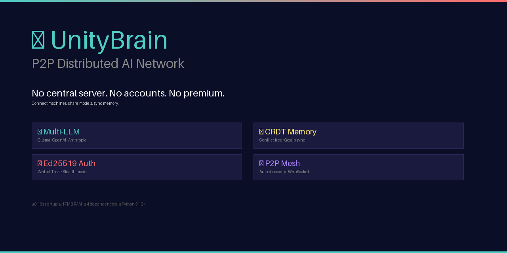

# 🌐 UnityBrain

<p align="center">
  
</p>

[](https://opensource.org/licenses/MIT)
[](https://www.python.org/downloads/)
[](https://github.com/dnshouet-cpu/Unitybrain)
[](https://github.com/dnshouet-cpu/Unitybrain)

**Lightweight P2P distributed AI network.** No central server. No accounts. No premium tier. Connect machines, share models, sync memory.

> 🌍 [English](./docs/README_EN.md) · 🇫🇷 [Français](./docs/README_FR.md) · 🇪🇸 [Español](./docs/README_ES.md) · 🇩🇪 [Deutsch](./docs/README_DE.md) · 🇯🇵 [日本語](./docs/README_JA.md) · 🇷🇺 [Русский](./docs/README_RU.md) · 🇨🇳 [简体中文](./docs/README_ZH.md)

---

## Two Ways to Use UnityBrain

### 🖥️ Standalone Application

UnityBrain runs as a **standalone application** — no OpenClaw, no Docker, no Kubernetes. Just Python and Ollama.

```bash
# Install in 30 seconds
git clone https://github.com/dnshouet-cpu/Unitybrain.git
cd Unitybrain
python3 setup.py --auto

# That's it. You now have:
#   unitybrain          → Interactive AI chat CLI
#   unitybrain start    → Start P2P server
#   ~/.unitybrain/      → Config, logs, venv
```

Install on another machine with the same `p2p_secret` → they find each other automatically. **More nodes = more CPU/RAM = more power.**

### 🔌 OpenClaw Plugin

Already using [OpenClaw](https://openclaw.ai)? UnityBrain integrates as a skill:

```bash
openclaw skill install unitybrain
```

Your OpenClaw agent gets P2P AI access — query any model on the network, share memory between agents, use remote GPU/CPU transparently.

**Either way, UnityBrain is the same P2P network.** Standalone users and OpenClaw users share the same mesh.

---

## Why this exists

Every AI tool wants your email, your phone number, and $20/month. Cloud APIs lock you in. Self-hosted solutions need Kubernetes and a DevOps degree.

**UnityBrain is the alternative.** Two or two thousand machines, one config file each, and they're a distributed AI network. No Docker. No SaaS. No middleman. Your machines talk directly, share AI responses, and sync memory — if one goes down, the others keep working. The more nodes, the stronger the network.

---

## At a glance

| | What you get |
|---|---|
| **LLM Providers** | Ollama · OpenAI · Anthropic · Any OpenAI-compatible API (LM Studio, vLLM, etc.) — plug in your keys, models are shared across the P2P network |
| **P2P Communication** | Bidirectional WebSocket (`/ws`) + HTTP REST — real-time sync with gossip protocol |
| **Distributed Memory** | CRDT-based conflict-free state · Vector clocks · Gossip propagation · TTL support |
| **Decentralized Auth** | Ed25519 identity · HMAC shared secret · Web of Trust (PGP-like) · Stealth mode |
| **AI Routing** | Local models first → cloud on demand → peer failover · Ensemble consensus · Circuit breakers |
| **GPU/CPU Negotiation** | Auto-detect hardware · Route 70B models to GPU nodes · Small models on CPU · Smart peer selection |
| **Sharing Quotas** | Score-based query limits — **the more you share, the more you can use** · Gamified tiers (🌱 → 🌟) |
| **Auto-Discovery** | Static config · Tailscale auto-discovery · **mDNS Zero-Config** · Dynamic API registration |
| **OpenClaw Sidekick** | Plug & Play — UnityBrain detected automatically · `/api/agent` endpoint for AI agents |
| **Interactive CLI** | `unitybrain` command — chat with AI, manage memory, check peers and quotas |
| **Stats** | ⚡ 0.16s startup · 💾 17MB RAM · 📦 4 dependencies (aiohttp, psutil, PyYAML, PyNaCl optional) |

---

## Quick Start

### Standalone Install

```bash
git clone https://github.com/dnshouet-cpu/Unitybrain.git
cd Unitybrain

# Automatic install (defaults: share_ai=true, auto-secret)
python3 setup.py --auto

# Or interactive
python3 setup.py

# Then:
unitybrain              # Interactive AI chat CLI
unitybrain start        # Start P2P server
```

### Manual Install (no setup.py)

```bash
pip install aiohttp psutil
python3 src/unitybrain_v4.py mynode
```

### Connect Your Network

1. Install UnityBrain on each machine
2. Set the **same `p2p_secret`** in all configs
3. They discover each other automatically (via Tailscale or local network)

```json
// ~/.unitybrain/config/mynode.json
{
  "node_name": "bug",
  "port": 8080,
  "share_ai": true,
  "p2p_secret": "shared-secret-here",
  "providers": {
    "ollama": {
      "type": "ollama",
      "host": "127.0.0.1",
      "port": 11434,
      "models": ["glm-5.1:cloud"],
      "enabled": true
    }
  }
}
```

**`share_ai: true`** means this node shares its CPU/RAM/models with the network. Set `false` to keep models private while still connected to P2P.

### Add OpenAI or Anthropic

```json
"providers": {
  "ollama": { "type": "ollama", "host": "127.0.0.1", "port": 11434, "models": ["glm-5.1:cloud"], "enabled": true },
  "openai": { "type": "openai", "api_key": "sk-...", "models": ["gpt-4o", "gpt-4o-mini"], "enabled": true },
  "anthropic": { "type": "anthropic", "api_key": "sk-ant-...", "models": ["claude-sonnet-4-20250514"], "enabled": true }
}
```

Queries with `"model": "gpt-4o"` are automatically routed to OpenAI. No code changes. Models from all providers are visible across the P2P network.

---

## Sharing Quotas — Plus tu partages, plus tu peux utiliser

Every peer gets a **sharing score** (0-100) based on contribution:

| Factor | Weight | What counts |
|--------|--------|-------------|
| Models hosted | 40% | Share your GPU/CPU with the network |
| Chunks distributed | 30% | Memory entries shared via gossip |
| Uptime | 20% | Stay online, earn trust |
| Reputation | 10% | Serve queries reliably |

Score → queries/minute allowed:

| Score | Quota |
|-------|-------|
| <10 | 1 q/min |
| <20 | 5 q/min |
| <40 | 20 q/min |
| <60 | 50 q/min |
| <80 | 100 q/min |
| ≥80 | 200 q/min |

**Freeloaders get 1 query/minute.** Share one model → 5 q/min. Share three models and stay online 24h → 50+ q/min.

```bash
# Check quotas
unitybrain /quota
curl http://localhost:8080/api/quota
```

---

## Interactive CLI

```bash
unitybrain                    # Start interactive chat
unitybrain -q "Hello"         # Single query
unitybrain -m gpt-4o          # Use specific model
unitybrain --ensemble         # Multi-model consensus
```

### CLI Commands

| Command | Description |
|---------|-------------|
| `/status` | Node status, uptime, peers |
| `/peers` | Connected peers and their models |
| `/models` | Available AI models |
| `/quota` | Sharing quotas for all peers |
| `/model <name>` | Set default model |
| `/ensemble <prompt>` | Multi-model consensus query |
| `/memory set/get` | Distributed memory operations |
| `/history` | Query history |
| `/config` | Current configuration |
| `/help` | Show all commands |

---

## API Reference

### REST Endpoints

| Method | Path | Auth | Description |
|--------|------|------|-------------|
| GET | `/api/ping` | No | Health check |
| GET | `/api/status` | No | Node status, providers, peers, memory, quotas |
| GET | `/api/quota` | No | All peer sharing quotas |
| GET | `/api/quota/{peer}` | No | Specific peer quota |
| GET | `/api/memory/{key}` | No | Read a memory entry |
| POST | `/api/memory/set` | Yes | Write a memory entry |
| POST | `/api/memory/push` | Yes | Push memory entries (sync) |
| POST | `/api/query` | Yes | Query AI models |
| POST | `/api/brain/chain` | Yes | Chain multiple AI queries |
| POST | `/api/trust/sign` | Yes | Sign a peer's key (Web of Trust) |

### WebSocket (`/ws`)

```json
{"type": "auth", "hmac": "<signature>", "ts": "<timestamp>"}
{"type": "ping"}
{"type": "query", "prompt": "Hello!", "model": "gpt-4o"}
{"type": "memory_request", "vector_clock": {}}
{"type": "memory_update", "key": "mykey", "entry": {"value": "mydata"}}
```

### Authentication

```bash
TIMESTAMP=$(date +%s)
SIGNATURE=$(echo -n "/api/query:${TIMESTAMP}" | openssl dgst -sha256 -hmac "your-secret" | awk '{print $NF}')

curl -X POST http://localhost:8080/api/query \
  -H "X-UnityBrain-Auth: ${SIGNATURE}" \
  -H "X-UnityBrain-TS: ${TIMESTAMP}" \
  -H "Content-Type: application/json" \
  -d '{"prompt":"Hello","model":"glm-5.1:cloud"}'
```

---

## Architecture

```
┌─────────────────────────────────────────────┐
│                  Node (Bug)                  │
│  ┌──────────┐  ┌──────────┐  ┌───────────┐ │
│  │ Providers │  │WebSocket │  │   CRDT    │ │
│  │ Ollama ◄──┤  │  Server  │  │  Memory   │ │
│  │ OpenAI   │  └────┬─────┘  └─────┬─────┘ │
│  │Anthropic │       │              │       │
│  │ Custom   │───────┴──────────────┘       │
│  └──────────┘                              │
│       │    ┌──────────────┐                │
│  ┌────┴────┤ SharingQuota │                │
│  │AI Router│  models: 40% │                │
│  └─────────┘  chunks: 30% │               │
│                uptime: 20% │               │
│                 rep:   10% │               │
│                └──────────────┘            │
└───────────┬─────────────────────────────────┘
            │
        P2P ◄──► Other Nodes
```

---

## Configuration

| Key | Default | Description |
|-----|---------|-------------|
| `node_name` | required | Unique node name |
| `port` | `8080` | HTTP/WS port |
| `p2p_secret` | required | HMAC shared secret for peer auth |
| `providers` | `{}` | LLM providers (Ollama, OpenAI, Anthropic, custom) |
| `peers` | `[]` | Peer nodes |
| `share_ai` | `true` | Share CPU/RAM/models with network (participant mode) |
| `stealth_mode` | `false` | Hidden node, trusted peers only |
| `memory_max_size` | `1000` | Max memory entries |
| `tailscale_auto_discovery` | `true` | Auto-discover Tailscale peers |

### Two modes

| `share_ai` | Effect |
|------------|--------|
| `true` | **Participant** — shares models, CPU, RAM with network. Earns higher quota. |
| `false` | **Private** — connected to P2P, but models stay local. Can still query other peers. |

---

## Running as a Service

```bash
# After python3 setup.py --auto, the service is created automatically
systemctl --user daemon-reload
systemctl --user enable --now unitybrain
```

Or manually:

```ini
# ~/.config/systemd/user/unitybrain.service
[Unit]
Description=UnityBrain P2P Node
After=network.target

[Service]
Type=simple
WorkingDirectory=%h/.unitybrain/src
ExecStart=%h/.unitybrain/venv/bin/python3 unitybrain_v4.py mynode
Restart=always
RestartSec=5
Environment=PYTHONPATH=%h/.unitybrain/src

[Install]
WantedBy=default.target
```

---

## Philosophy

**No mining. No premium tier. No hidden costs.** Just free, open, distributed AI.

The sharing quota system rewards contribution, not payment. Share a model → get more queries. Stay online → earn trust. Everyone starts at 1 q/min and can grow to 200 q/min by contributing. No credit card needed.

Built by Bug 🐛 and Denis Houet — a small bug in the machine and a human who believes in symbiosis, not hierarchy.

**BTC:** `bc1qhpm800k35jfpwsnkepp7u8q9uruyvd3nycrh6x`

---

## License

MIT License — see [LICENSE](LICENSE) for details.